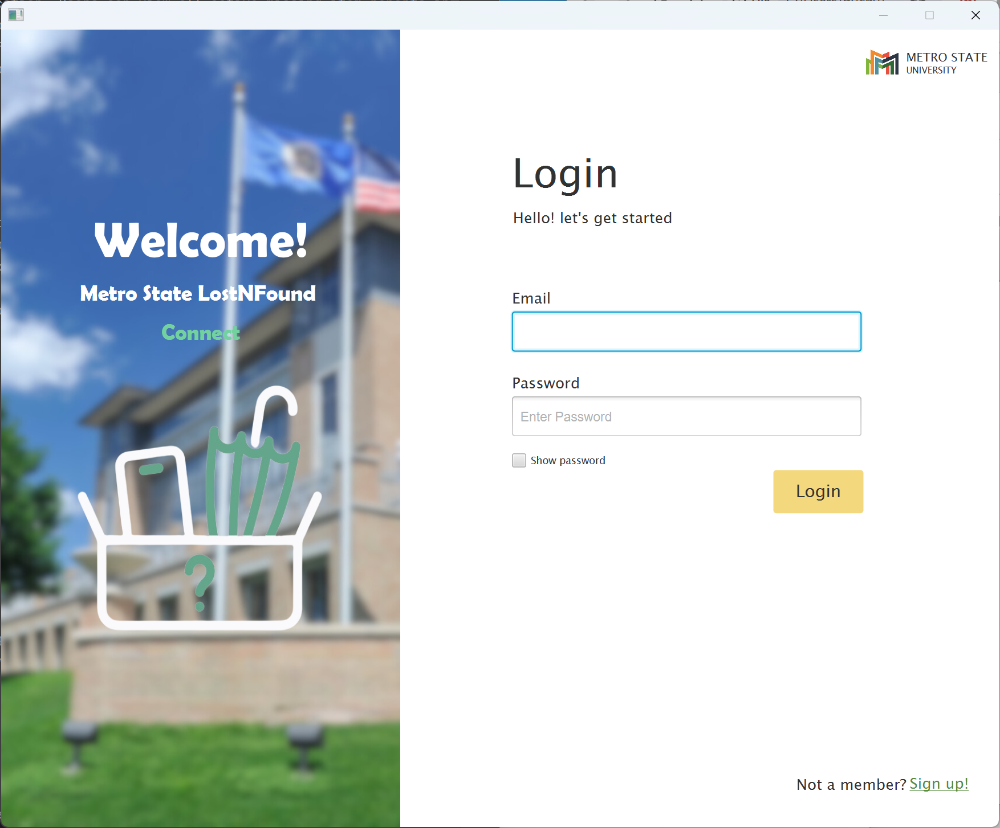
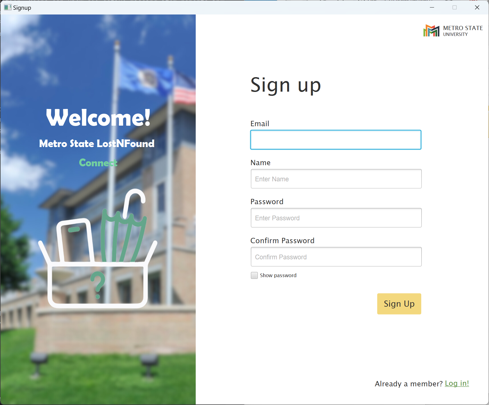
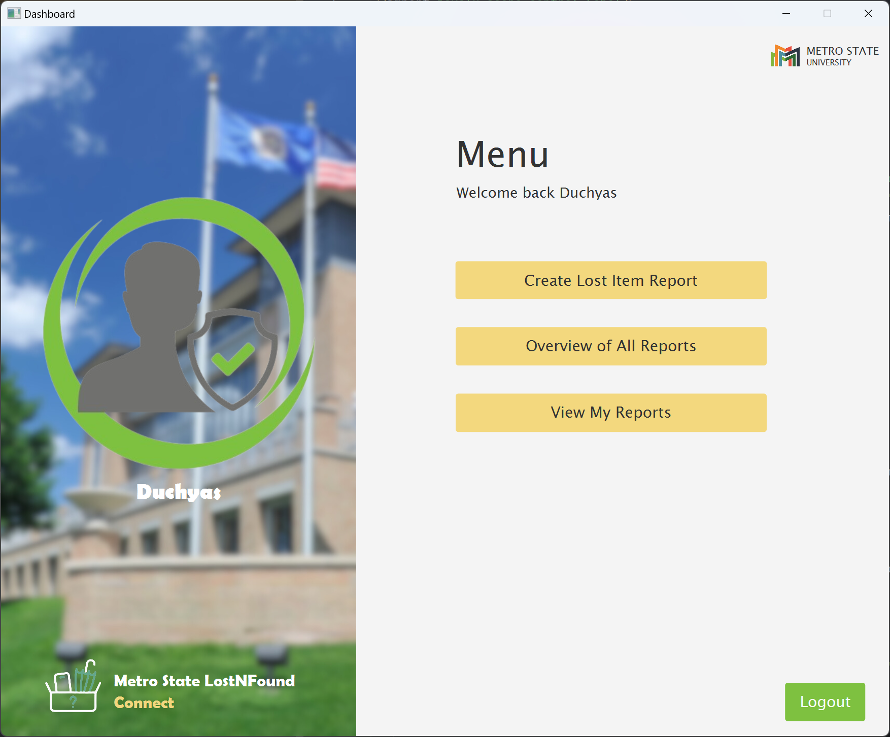
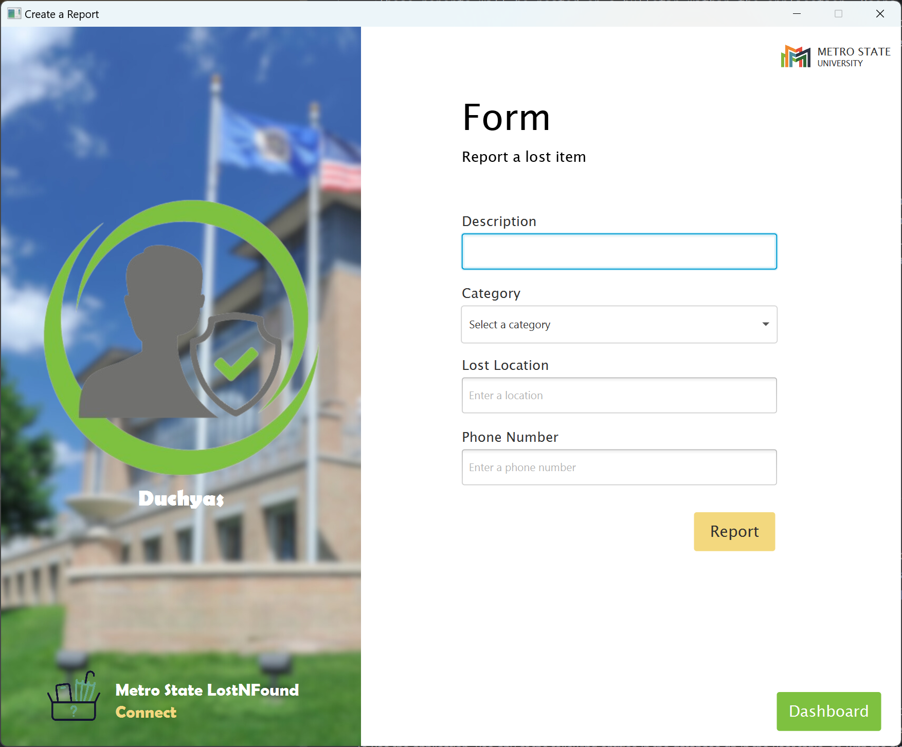
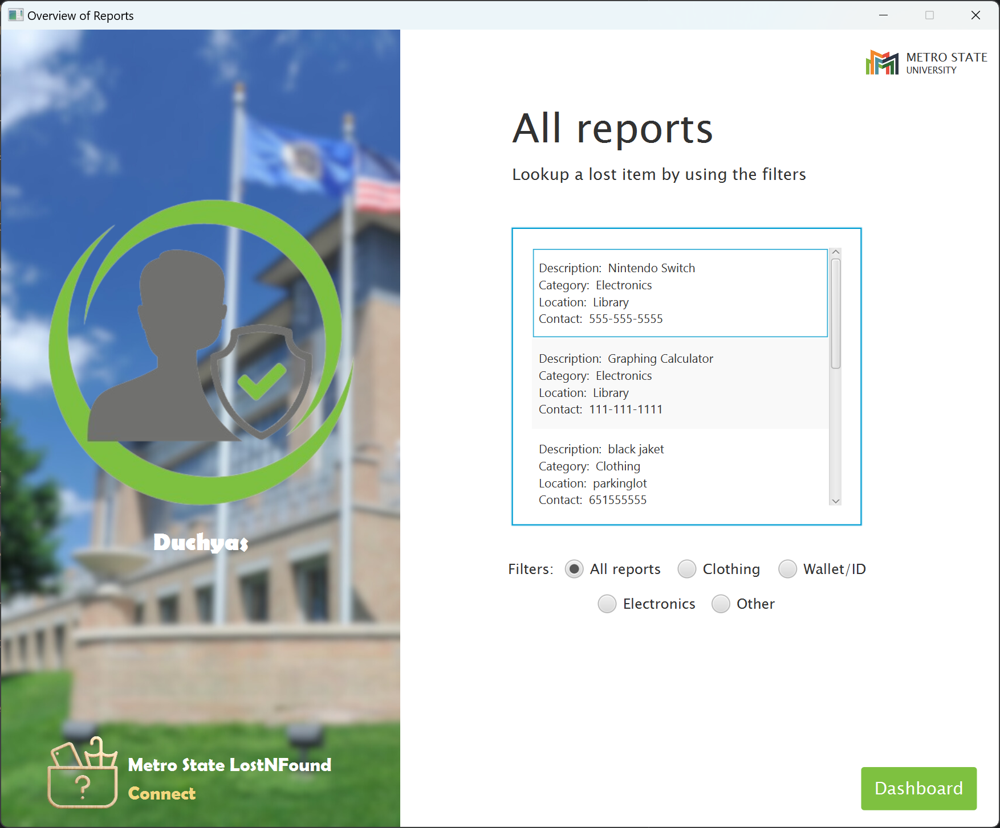
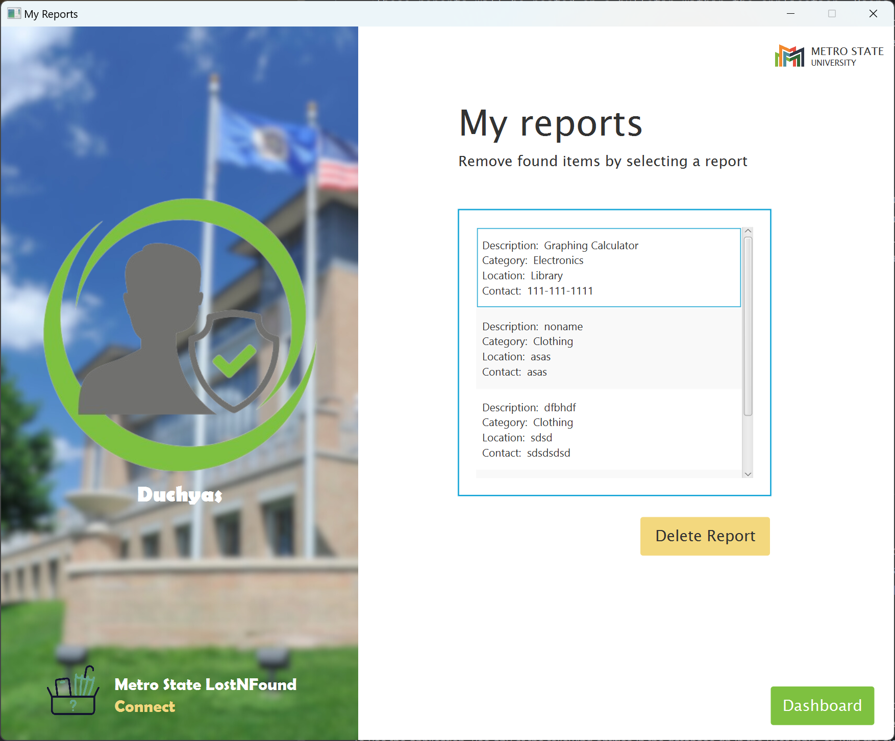

**Overview of Metro LostNFound Application**

This application provides a platform for reporting belongings lost on campus. A user can create a report describing the 
lost item, specifying the location where it was lost, and providing contact information for the finder to reach out. 
These reports will be posted on a bulletin within the application. Users can view all active missing item reports in 
the "Overview of Reports" screen. If someone finds an item on campus that doesn't belong to them, they can search 
through these active reports using the application to see if it's been reported missing. If a match is found, they can 
contact the owner directly through the contact information provided.

**Running the Application:**

To run the application, follow these steps:

- Open the project in an IDE like IntelliJ IDEA.
- Configure any necessary dependencies and settings.
- Run the application by executing the main class "MainApplication".
- The application will launch, and the login screen will appear.
- Use the provided user credentials or sign up for a new account.
- After logging in, navigate through different screens using the dashboard buttons to create reports, 
view reports, or access other functionalities.

**User table**

You can use any of the following entities found in the database.db

- user_id      name          email               password
- 1            Ryan          ryan@email.com      abc123
- 2            Duchyas       duchyas@email.com   123abc
- 3            Cheng         cheng@email.com     1abc23
- 4            Ishita        ishita@email.com    12abc3
- 5            Sam           sam@email.com       a123bc

**Code Structure:**

- Interface: The SceneChanger interface defines a method changeScene to facilitate scene navigation within the application. 
Controller classes implement this interface.

- Abstract Class: The LoggedInController abstract class provides common functionalities for controllers used after user 
login. It implements the SceneChanger interface and includes methods for logging out and navigating to the dashboard.

**Non-Abstract Classes:**

- SignupController: Handles user sign-up functionality, allowing new users to create accounts.

- LoginController: Manages user authentication by verifying credentials against the database.

- DashboardController: Controls the main dashboard screen after user login, enabling access to various features.

- CreateReportController: Facilitates the creation of lost item reports, capturing details such as description, 
category, and contact information.

- OverviewController: Displays an overview of all lost item reports, allowing users to filter and search for specific reports.

- MyReportsController: Provides a view of reports created by the current user and includes a feature to delete reports.

**Models:**

- Report: Represents a lost item report, containing attributes such as ID, description, category, location, 
and contact information.

- User: Manages user data, including methods for retrieving and updating user information in the database.

- DBUtility: Handles database interactions, including adding, retrieving, and deleting reports and user data.

**Location of Classes Satisfying Code Implementation Requirements:**

- Classes satisfying the code implementation requirements are spread across the codebase:
- User authentication and dashboard functionalities are implemented in LoginController and DashboardController.
- Report creation and management are handled by CreateReportController, OverviewController, and MyReportsController.
- The database interaction layer is managed by DBUtility.
- Supportive entities such as Report and User encapsulate data structures and operations related to reports and users.
- FXML files define the layout and appearance of the user interface screens.

**Functional Requirements:**

1 - Sign up for a new user:

- Implementation: Implemented in the SignupController class. Users can enter their email and password to create a new 
account. Input validation ensures that all required fields are filled, and the email is unique.
- Testing: Testers can click the sign-up button, enter valid details, and verify that a new user account is 
successfully created in the database. They can also attempt to sign up with an existing email to verify that the 
application prevents duplicate accounts.

2 - User Authentication:

- Implementation: Implemented in the LoginController class. Users must enter their email and password to access the 
application. Authentication is performed by verifying the entered credentials against the user database.
- Testing: Testers can log in with valid credentials and verify that access is granted to the dashboard. 
They can also attempt to log in with invalid credentials to ensure that the application displays an appropriate 
error message.

3 - Lost Object Report:

- Implementation: Implemented in the CreateReportController class. Users can fill out a form describing the lost item, 
including its description, category, location, and contact information. The report is stored in the database 
upon submission.
- Testing: Testers can navigate to the report creation screen, submit a report with valid details, and verify 
that the report is successfully stored in the database. They can also verify that the report appears in the 
overview of reports.

4 - Overview of Lost Reports:

- Implementation: Implemented in the OverviewController class. Users can view all active lost item reports in this 
screen. Reports are retrieved from the database and displayed with relevant details.
- Testing: Testers can access the overview screen and verify that all active lost item reports are displayed 
accurately. They can also filter and search for specific reports to ensure that the functionality works as expected.

5 - Search and Filter:

- Implementation: Implemented in the OverviewController class. Users can search for specific lost item 
reports using keywords and apply filters based on categories. The application retrieves and displays matching 
reports accordingly.
- Testing: Testers can perform various search queries and apply filters to verify that the search results are 
accurate. They can also test scenarios where no matching reports are found to ensure that the application 
handles such cases gracefully.

6 - Viewing user reports:

- Implementation: Implemented in the MyReportsController class. Users can view reports submitted by themselves in 
this screen. Reports are retrieved from the database and displayed exclusively for the current user.
- Testing: Testers can access the "My Reports" screen and verify that only reports created by the current user are 
displayed. They can also verify that the information displayed is accurate and matches the user's submitted reports.

7 - Delete a report:

- Implementation: Partially implemented in the MyReportsController class. Users can attempt to delete their own 
reports using a delete button. However, the functionality to delete reports from the database is not fully implemented.
- Testing: Testers can attempt to delete a report created by the current user and verify that the report is no 
longer displayed in the "My Reports" screen. They can also ensure that an appropriate message is displayed 
if the deletion fails.

8 - Log-out:

- Implementation: Implemented in the LoggedInController class. Users can log out of the application by clicking the 
logout button. The application redirects them to the login screen.
Testing: Testers can click the logout button and verify that they are successfully redirected to the login screen. 
They can also attempt to access protected pages without authentication to ensure that they are redirected 
to the login screen.

**Non-Functional Requirements:**

1 - Ease of Use:

- Implementation: The application has a simple and intuitive user interface with consistent styling. Clear and helpful 
feedback messages are displayed for user actions and errors.
- Testing: Testers can interact with the application and verify that the user interface is easy to navigate. They can 
also perform actions and observe the feedback messages to ensure clarity and helpfulness.

2 - Security:

- Implementation: The application prevents unauthorized access to user data by requiring authentication. Passwords are 
securely stored and compared against hashed values in the database. Access control mechanisms ensure that users can 
only view and modify their own data.
- Testing: Testers can attempt to access restricted pages without authentication and verify that they are redirected to 
the login screen. They can also inspect the database to ensure that passwords are stored securely.

3 - Fault Tolerance:

- Implementation: The application is designed to handle errors gracefully and maintain high availability. Error 
handling mechanisms are implemented to catch and handle exceptions. Regular backups of the database ensure data 
integrity and availability.
- Testing: Testers can intentionally trigger errors and exceptions to verify that the application handles them 
appropriately. They can also perform stress testing to evaluate the application's performance under load.

4 - Maintainability:

- Implementation: The codebase is well-commented and follows best practices to ensure maintainability. Modular design 
and separation of concerns make it easier to update and extend the application in the future.
- Testing: Testers can review the codebase and verify that it is well-commented and organized. They can also assess 
the ease of making changes or additions to the application's functionality.

**Login Screen**

**Signup Screen**

**Dashboard Screen**

**Create Lost Item Report Screen**

**Overview of all Reports Screen**

**My Reports Screen**

